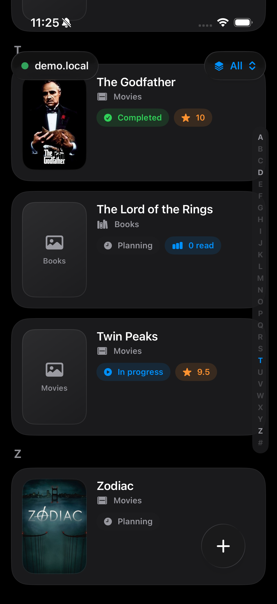
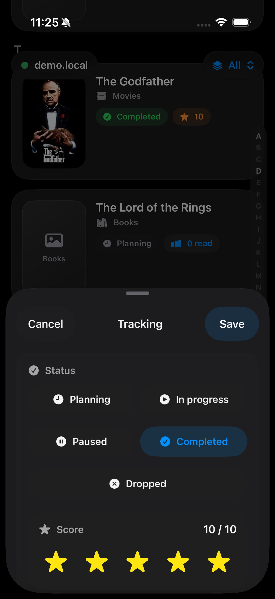

<p align="center">
  
</p>

An (unofficial) iOS client for [Yamtrack](https://github.com/FuzzyGrim/Yamtrack) with a library-first interface for browsing, adding, and updating media.

## 🔌 API Note

- This app currently relies on the new Yamtrack API from draft PR [FuzzyGrim/Yamtrack#924](https://github.com/FuzzyGrim/Yamtrack/pull/924).
- To connect the app to a local or self-hosted Yamtrack instance, you also need a valid Yamtrack API token.

## 🛠️ Local Setup

1. Clone this repository and open the Xcode project:

   ```bash
   git clone https://github.com/FuzzyGrim/yamtrack-ios.git
   cd yamtrack-ios
   open YamtrackiOS.xcodeproj
   ```

2. Clone the Yamtrack backend in a separate directory, then check out the API PR branch used by the iOS app:

   ```bash
   git clone https://github.com/FuzzyGrim/Yamtrack.git
   cd Yamtrack
   git fetch origin pull/924/head:feat/add-api
   git checkout feat/add-api
   ```

3. Start the local API:

   ```bash
   docker compose -f docker-compose.local-api.yml up --build
   ```

4. Open [http://localhost:8000](http://localhost:8000), create an account or sign in, then copy your API token from `Settings > Integrations`.

5. Run the iOS app from Xcode and enter these values on the `Connect` screen:
   - `Server URL`: `http://localhost:8000`
   - `API Token`: the token you copied from Yamtrack

## 🧭 Future Work

- [ ] Autogenerate API client
  - [x] Validate whether [apple/swift-openapi-generator](https://github.com/apple/swift-openapi-generator) can generate a usable client for Yamtrack in a spike branch (`codex/openapi-generator-spike`)
  - [ ] Possible, but not a good fit right now because the API and OpenAPI document are still evolving
  - [ ] The spike found a few quirks that the current handwritten client already smooths over manually
    - mixed `media_id` typing between provider creates and detail-style routes
    - incomplete response modeling for some routes, especially update flows

## 📸 Screenshots

<p align="center">
  
  
  
</p>

<p align="center">
  
  
</p>
